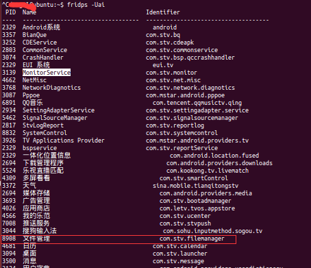
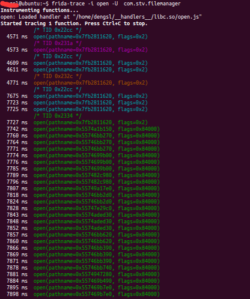
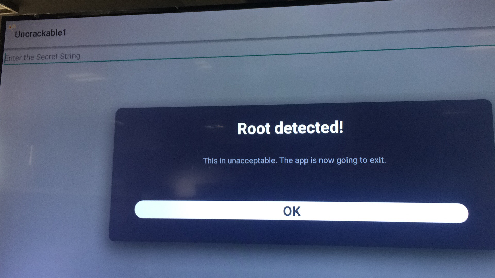

# Android Frida

---
http://www.ninoishere.com/frida-learn-by-example/

---

## 编译Frida-server 也可以直接下载
- 设置ANDROID_NDK_ROOT 
- 直接 make server-android 即可

在build文件夹中 

## Firda 工具安装
sudo pip install frida

## 基本验证
push frida-server 到Android 端

PC端 使用命令check

## 实验
### Frida-trace 扩展

### iOS  拦截API

---
后面的实验 资源均来自
https://github.com/illnino/frida-learn-by-example
---

### Root Detection Bypass, Hook the password [Android]

1. adb install *.apk

~~~~
**@ubuntu:~/kanxue/frida-learn-by-example/3. Root_detection_hook_password$ frida -U -f sg.vantagepoint.uncrackable1
     ____
    / _  |   Frida 10.5.6 - A world-class dynamic instrumentation framework
   | (_| |
    > _  |   Commands:
   /_/ |_|       help      -> Displays the help system
   . . . .       object?   -> Display information about 'object'
   . . . .       exit/quit -> Exit
   . . . .
   . . . .   More info at http://www.frida.re/docs/home/
Spawned `sg.vantagepoint.uncrackable1`. Use %resume to let the main thread start executing!
[MStar Semiconductor, Inc. Unique75::sg.vantagepoint.uncrackable1]-> %resume
[MStar Semiconductor, Inc. Unique75::sg.vantagepoint.uncrackable1]-> %load
load command expects 1 argument
[MStar Semiconductor, Inc. Unique75::sg.vantagepoint.uncrackable1]-> %load exploit1.js
[MStar Semiconductor, Inc. Unique75::sg.vantagepoint.uncrackable1]-> [*] Starting script
[*] onClick handler modified
[*] onClick called
[MStar Semiconductor, Inc. Unique75::sg.vantagepoint.uncrackable1]-> 
[MStar Semiconductor, Inc. Unique75::sg.vantagepoint.uncrackable1]-> %load exploit2.js
[MStar Semiconductor, Inc. Unique75::sg.vantagepoint.uncrackable1]-> [*] Starting script
[*] onClick handler modified
[*] sg.vantagepoint.a.a.a modified
[*] Decrypted: I want to believe

~~~~

### Brute Force PIN [Android]
1.   adb install *apk 

2.   frida-ps -Uai
~~~~
*l@ubuntu:~/kanxue/frida-learn-by-example/4. brute_force_pin$ frida-ps -Uai
  PID  Name                                Identifier                          
-----  ----------------------------------  ------------------------------------
 2329  Android系统                           android                             
 3357  BianQue                             com.stv.bq                          
 3252  CDEService                          com.stv.cdeapk                      
 2803  CommonService                       com.stv.commonservice               
 3074  CrashHandler                        com.stv.bsp.qccrashhandler          
 2329  EUI 系统                              eui.tv                              
12122  LeKey                               com.stv.lekey                       
10696  LolliPin                            com.github.orangegangsters.lollipin 
 3139  MonitorService                      com.stv.monitor                     
 2050  MusicFX                             com.android.musicfx                 
 4662  NetMisc                             com.stv.net.misc                    
 3768  NetworkDiagnotics                   com.stv.network.diagnotics          
 2085  Pico TTS                            com.svox.pico                       
 3087  Pppoe                               com.mstar.android.pppoe             
12381  QQ音乐                                com.tencent.qqmusictv.qing    

~~~~
找到 Lollipin  这个之前已经resume了 ，开始是没有PID的

3. 暴力破解
~~~~
dengsl@ubuntu:~/kanxue/frida-learn-by-example/4. brute_force_pin$ python exploit.py 
[*] Bruteforcing PIN code
[*] Testing PIN 1230: false
[*] Testing PIN 1231: false
[*] Testing PIN 1232: true
[*] Testing PIN 1233: false
[*] Testing PIN 1234: false

~~~~
找到PIN码 是返回true

### 实验  Get Encryption Key

1. install apk
2. frida-ps -Uai

~~~~
frida-ps -Uai
  PID  Name                                Identifier                          
-----  ----------------------------------  ------------------------------------
 2329  Android系统                           android                             
 3357  BianQue                             com.stv.bq                          
 3252  CDEService                          com.stv.cdeapk                      
 2803  CommonService                       com.stv.commonservice               
 3074  CrashHandler                        com.stv.bsp.qccrashhandler          
 2329  EUI 系统                              eui.tv                      ***               
    -  mStar customer SDK Tests            tvtests.com.mstar.android.tv        
    -  yekehtmai                           kr.repo.h2spice.yekehtmai           
    -  万象搜索                                com.letv.leso                       
    -  下载中心                                com.stv.downloads                   
    -  主题                                  com.stv.thememanager       
~~~~
APK 对应的包名 kr.repo.h2spice.yekehtmai 

3.  resume  and load JS

~~~~
frida -U -f  kr.repo.h2spice.yekehtmai 
     ____
    / _  |   Frida 10.5.6 - A world-class dynamic instrumentation framework
   | (_| |
    > _  |   Commands:
   /_/ |_|       help      -> Displays the help system
   . . . .       object?   -> Display information about 'object'
   . . . .       exit/quit -> Exit
   . . . .
   . . . .   More info at http://www.frida.re/docs/home/
Spawned `kr.repo.h2spice.yekehtmai`. Use %resume to let the main thread start executing!
[MStar Semiconductor, Inc. Unique75::kr.repo.h2spice.yekehtmai]-> %resume
[MStar Semiconductor, Inc. Unique75::kr.repo.h2spice.yekehtmai]-> %load exploit.js
[MStar Semiconductor, Inc. Unique75::kr.repo.h2spice.yekehtmai]-> String1: kkkkk
String2: 3246847986364861
Error: Implementation for a expected return value compatible with 'java.lang.String'.
    at a (input:1)
String1: xxxxx
String2: 3246847986364861

~~~~
得到AES key  3246847986364861

